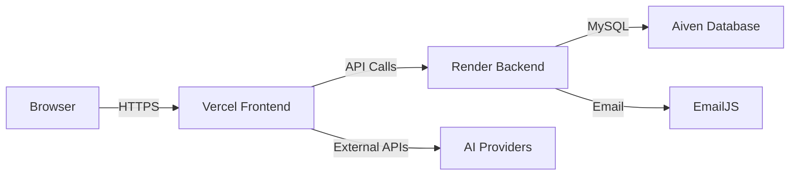

# Self-Hosting Installation

This guide covers deploying Home Account on your own infrastructure. The recommended setup uses:

- **Frontend**: Vercel (Next.js App Router)
- **Backend**: Render (Express API)
- **Database**: Aiven (Managed MySQL)

You can substitute any compatible hosting service.

<Warning>
Self-hosting requires managing security updates, database backups, and SSL certificates. Ensure you have the technical expertise or support to maintain production infrastructure.
</Warning>

## Architecture Overview



## Prerequisites

Before you begin, ensure you have:

- **Git**: For cloning the repository
- **Node.js**: v18 or higher
- **pnpm**: v10.13.1 or compatible (or npm/yarn)
- **MySQL**: v8.0 or higher (or Aiven account)
- **Vercel Account**: For frontend deployment (or alternative)
- **Render Account**: For backend deployment (or alternative)
- **EmailJS Account**: For password reset emails (optional but recommended)
- **OAuth Credentials**: Google and/or GitHub (optional)
- **AI Provider Keys**: Groq, Ollama, Claude, or Gemini (optional)

## Step 1: Clone the Repository

<Steps>
  <Step title="Clone the Repository">
    ```bash
    git clone https://github.com/yourusername/home-account.git
    cd home-account
    ```
  </Step>
  
  <Step title="Install Dependencies">
    ```bash
    # Install backend dependencies
    cd backend
    pnpm install
    
    # Install frontend dependencies
    cd ../frontend
    pnpm install
    ```
  </Step>
</Steps>

## Step 2: Database Setup (MySQL)

<Tabs>
  <Tab title="Aiven (Managed)">
    ### Create Aiven MySQL Instance
    
    <Steps>
      <Step title="Sign Up for Aiven">
        Go to [aiven.io](https://aiven.io) and create a free account. The free tier includes a MySQL instance suitable for development.
      </Step>
      
      <Step title="Create MySQL Service">
        1. Click **Create Service**
        2. Select **MySQL** as the service type
        3. Choose a cloud provider and region (closest to your backend)
        4. Select **Startup-4** plan (free tier) for testing
        5. Name your service (e.g., `home-account-db`)
        6. Click **Create Service**
      </Step>
      
      <Step title="Wait for Provisioning">
        The database takes 5-10 minutes to provision. Wait for status to show **Running**.
      </Step>
      
      <Step title="Get Connection Details">
        Click on your service and navigate to **Overview**:
        - **Host**: `mysql-xxxxxx.aivencloud.com`
        - **Port**: `25060` (default)
        - **Username**: `avnadmin`
        - **Password**: Auto-generated, click to reveal
        - **Database**: Create one named `home_account`
      </Step>
      
      <Step title="Download SSL Certificate">
        Aiven requires SSL. Download the CA certificate from the **Overview** tab (optional for localhost testing).
      </Step>
    </Steps>
  </Tab>
  
  <Tab title="Self-Hosted MySQL">
    ### Install MySQL Locally
    
    <Steps>
      <Step title="Install MySQL">
        ```bash
        # macOS (Homebrew)
        brew install mysql
        brew services start mysql
        
        # Ubuntu/Debian
        sudo apt update
        sudo apt install mysql-server
        sudo systemctl start mysql
        
        # Windows
        # Download from https://dev.mysql.com/downloads/mysql/
        ```
      </Step>
      
      <Step title="Secure Installation">
        ```bash
        sudo mysql_secure_installation
        ```
        
        Follow prompts to:
        - Set root password
        - Remove anonymous users
        - Disallow remote root login
        - Remove test database
      </Step>
      
      <Step title="Create Database and User">
        ```sql
        -- Login to MySQL
        mysql -u root -p
        
        -- Create database
        CREATE DATABASE home_account CHARACTER SET utf8mb4 COLLATE utf8mb4_unicode_ci;
        
        -- Create user (replace password)
        CREATE USER 'homeaccount'@'localhost' IDENTIFIED BY 'your-secure-password';
        
        -- Grant privileges
        GRANT ALL PRIVILEGES ON home_account.* TO 'homeaccount'@'localhost';
        FLUSH PRIVILEGES;
        
        EXIT;
        ```
      </Step>
    </Steps>
  </Tab>
</Tabs>

### Create Database Schema

Home Account requires tables for users, accounts, transactions, categories, etc.

<Note>
**Database migrations are not included in the repository.** You'll need to infer the schema from the TypeScript models or request the SQL schema file from the maintainers.
</Note>

Key tables to create:

```sql
-- Users table
CREATE TABLE users (
  id VARCHAR(36) PRIMARY KEY,
  email VARCHAR(255) UNIQUE NOT NULL,
  name VARCHAR(255) NOT NULL,
  password_hash VARCHAR(255),
  key_salt VARCHAR(64) NOT NULL,
  oauth_provider ENUM('local', 'google', 'github') DEFAULT 'local',
  oauth_id VARCHAR(255),
  avatar_url TEXT,
  email_verified BOOLEAN DEFAULT FALSE,
  verification_token VARCHAR(255),
  verification_token_expires DATETIME,
  verification_blob TEXT,
  recovery_blob TEXT,
  recovery_salt VARCHAR(64),
  bip39_verified BOOLEAN DEFAULT FALSE,
  pin_attempts INT DEFAULT 0,
  pin_locked_until DATETIME,
  reset_token_hash VARCHAR(255),
  reset_token_expires DATETIME,
  created_at DATETIME DEFAULT CURRENT_TIMESTAMP,
  updated_at DATETIME DEFAULT CURRENT_TIMESTAMP ON UPDATE CURRENT_TIMESTAMP,
  INDEX idx_email (email),
  INDEX idx_oauth (oauth_provider, oauth_id)
) ENGINE=InnoDB DEFAULT CHARSET=utf8mb4 COLLATE=utf8mb4_unicode_ci;

-- Accounts table (financial accounts)
CREATE TABLE accounts (
  id VARCHAR(36) PRIMARY KEY,
  name VARCHAR(255) NOT NULL,
  type ENUM('personal', 'shared', 'business') DEFAULT 'personal',
  currency VARCHAR(3) DEFAULT 'USD',
  created_by VARCHAR(36) NOT NULL,
  created_at DATETIME DEFAULT CURRENT_TIMESTAMP,
  updated_at DATETIME DEFAULT CURRENT_TIMESTAMP ON UPDATE CURRENT_TIMESTAMP,
  FOREIGN KEY (created_by) REFERENCES users(id) ON DELETE CASCADE
) ENGINE=InnoDB DEFAULT CHARSET=utf8mb4 COLLATE=utf8mb4_unicode_ci;

-- Account keys (encrypted with User Keys)
CREATE TABLE account_keys (
  account_id VARCHAR(36) NOT NULL,
  user_id VARCHAR(36) NOT NULL,
  encrypted_account_key TEXT NOT NULL,
  created_at DATETIME DEFAULT CURRENT_TIMESTAMP,
  PRIMARY KEY (account_id, user_id),
  FOREIGN KEY (account_id) REFERENCES accounts(id) ON DELETE CASCADE,
  FOREIGN KEY (user_id) REFERENCES users(id) ON DELETE CASCADE
) ENGINE=InnoDB DEFAULT CHARSET=utf8mb4 COLLATE=utf8mb4_unicode_ci;

-- Transactions table (E2E encrypted)
CREATE TABLE transactions (
  id VARCHAR(36) PRIMARY KEY,
  account_id VARCHAR(36) NOT NULL,
  subcategory_id VARCHAR(36),
  date DATE NOT NULL,
  description_encrypted TEXT NOT NULL,
  amount_encrypted TEXT NOT NULL,
  amount_sign ENUM('positive', 'negative', 'zero') NOT NULL,
  bank_category_encrypted TEXT,
  bank_subcategory_encrypted TEXT,
  created_at DATETIME DEFAULT CURRENT_TIMESTAMP,
  updated_at DATETIME DEFAULT CURRENT_TIMESTAMP ON UPDATE CURRENT_TIMESTAMP,
  FOREIGN KEY (account_id) REFERENCES accounts(id) ON DELETE CASCADE,
  INDEX idx_account_date (account_id, date),
  INDEX idx_amount_sign (amount_sign)
) ENGINE=InnoDB DEFAULT CHARSET=utf8mb4 COLLATE=utf8mb4_unicode_ci;

-- Categories table (E2E encrypted)
CREATE TABLE categories (
  id VARCHAR(36) PRIMARY KEY,
  account_id VARCHAR(36) NOT NULL,
  name_encrypted TEXT NOT NULL,
  color VARCHAR(7) NOT NULL,
  icon VARCHAR(10),
  created_at DATETIME DEFAULT CURRENT_TIMESTAMP,
  updated_at DATETIME DEFAULT CURRENT_TIMESTAMP ON UPDATE CURRENT_TIMESTAMP,
  FOREIGN KEY (account_id) REFERENCES accounts(id) ON DELETE CASCADE,
  INDEX idx_account (account_id)
) ENGINE=InnoDB DEFAULT CHARSET=utf8mb4 COLLATE=utf8mb4_unicode_ci;

-- Add more tables as needed (subcategories, budgets, invitations, etc.)
```

## Step 3: Backend Configuration

<Steps>
  <Step title="Copy Environment Template">
    ```bash
    cd backend
    cp .env.example .env
    ```
  </Step>
  
  <Step title="Configure Database">
    Edit `.env` with your database connection details:
    
    ```bash
    # Database - Aiven MySQL
    DB_HOST=mysql-xxxxxx.aivencloud.com
    DB_PORT=25060
    DB_USER=avnadmin
    DB_PASSWORD=your-aiven-password
    DB_DATABASE=home_account
    ```
  </Step>
  
  <Step title="Generate JWT Secret">
    Generate a secure random string for JWT signing:
    
    ```bash
    # Generate 64-character hex string
    node -e "console.log(require('crypto').randomBytes(32).toString('hex'))"
    ```
    
    Add to `.env`:
    
    ```bash
    JWT_SECRET=your-generated-secret-here
    JWT_EXPIRES_IN=7d
    ```
  </Step>
  
  <Step title="Configure Frontend URL">
    Set the frontend URL for CORS:
    
    ```bash
    # Development
    FRONTEND_URL=http://localhost:3000
    
    # Production (Vercel)
    FRONTEND_URL=https://your-app.vercel.app
    ```
  </Step>
  
  <Step title="Configure OAuth (Optional)">
    #### Google OAuth
    
    1. Go to [Google Cloud Console](https://console.cloud.google.com/apis/credentials)
    2. Create a new project or select existing
    3. Enable **Google+ API**
    4. Create **OAuth 2.0 Client ID**
       - Application type: **Web application**
       - Authorized redirect URIs: `http://localhost:3001/api/auth/google/callback` (dev) and `https://your-backend.onrender.com/api/auth/google/callback` (prod)
    5. Copy Client ID and Client Secret
    
    ```bash
    GOOGLE_CLIENT_ID=your-google-client-id.apps.googleusercontent.com
    GOOGLE_CLIENT_SECRET=your-google-client-secret
    ```
    
    #### GitHub OAuth
    
    1. Go to [GitHub Developer Settings](https://github.com/settings/developers)
    2. Click **New OAuth App**
    3. Fill details:
       - **Application name**: Home Account
       - **Homepage URL**: `http://localhost:3000`
       - **Authorization callback URL**: `http://localhost:3001/api/auth/github/callback`
    4. Copy Client ID and generate Client Secret
    
    ```bash
    GITHUB_CLIENT_ID=your-github-client-id
    GITHUB_CLIENT_SECRET=your-github-client-secret
    ```
    
    Set callback URL:
    
    ```bash
    OAUTH_CALLBACK_URL=http://localhost:3001
    ```
  </Step>
  
  <Step title="Configure EmailJS (Optional)">
    For password reset emails:
    
    1. Sign up at [EmailJS](https://www.emailjs.com/)
    2. Create an email service (Gmail, Outlook, etc.)
    3. Create a template for password reset with variables: `{{to_email}}`, `{{reset_link}}`, `{{user_name}}`
    4. Get credentials from **Account** page
    
    ```bash
    EMAILJS_SERVICE_ID=service_xxxxxxx
    EMAILJS_TEMPLATE_ID=template_xxxxxxx
    EMAILJS_PUBLIC_KEY=your-public-key
    EMAILJS_PRIVATE_KEY=your-private-key
    ```
  </Step>
</Steps>

### Complete .env File Example

```bash
# Server
PORT=3001
FRONTEND_URL=http://localhost:3000

# Database - Aiven MySQL
DB_HOST=mysql-xxxxxx.aivencloud.com
DB_PORT=25060
DB_USER=avnadmin
DB_PASSWORD=your-secure-password
DB_DATABASE=home_account

# JWT
JWT_SECRET=your-64-char-hex-secret-here
JWT_EXPIRES_IN=7d

# OAuth (optional)
GOOGLE_CLIENT_ID=your-client-id.apps.googleusercontent.com
GOOGLE_CLIENT_SECRET=your-client-secret
GITHUB_CLIENT_ID=your-github-client-id
GITHUB_CLIENT_SECRET=your-github-client-secret
OAUTH_CALLBACK_URL=http://localhost:3001

# EmailJS (optional)
EMAILJS_SERVICE_ID=service_xxxxxxx
EMAILJS_TEMPLATE_ID=template_xxxxxxx
EMAILJS_PUBLIC_KEY=your-public-key
EMAILJS_PRIVATE_KEY=your-private-key
```

## Step 4: Frontend Configuration

<Steps>
  <Step title="Copy Environment Template">
    ```bash
    cd frontend
    cp .env.example .env.local
    ```
  </Step>
  
  <Step title="Configure API URL">
    Edit `.env.local`:
    
    ```bash
    # Development
    NEXT_PUBLIC_API_URL=http://localhost:3001/api
    API_URL=http://localhost:3001/api
    
    # Production (after deploying backend)
    # NEXT_PUBLIC_API_URL=https://your-backend.onrender.com/api
    # API_URL=https://your-backend.onrender.com/api
    ```
    
    - `NEXT_PUBLIC_API_URL`: Used by client-side code (exposed to browser)
    - `API_URL`: Used by Server Components (not exposed)
  </Step>
  
  <Step title="Set Node Environment">
    ```bash
    NODE_ENV=development
    ```
  </Step>
</Steps>

## Step 5: Local Development Testing

<Steps>
  <Step title="Start Backend">
    ```bash
    cd backend
    pnpm dev
    # Server running on http://localhost:3001
    ```
  </Step>
  
  <Step title="Start Frontend (New Terminal)">
    ```bash
    cd frontend
    pnpm dev
    # Next.js running on http://localhost:3000
    ```
  </Step>
  
  <Step title="Test Registration">
    1. Open browser to `http://localhost:3000`
    2. Click **Register**
    3. Create an account
    4. Verify you can login and see the dashboard
  </Step>
  
  <Step title="Test Encryption">
    1. Add a test transaction
    2. Check your MySQL database:
    
    ```sql
    SELECT description_encrypted, amount_encrypted FROM transactions LIMIT 1;
    ```
    
    You should see base64-encoded encrypted blobs, not plaintext.
  </Step>
</Steps>

## Step 6: Deploy Backend to Render

<Steps>
  <Step title="Create Render Account">
    Sign up at [render.com](https://render.com) (free tier available).
  </Step>
  
  <Step title="Create New Web Service">
    1. Click **New +** → **Web Service**
    2. Connect your GitHub repository (fork Home Account first)
    3. Configure:
       - **Name**: `home-account-api`
       - **Region**: Choose closest to your users
       - **Branch**: `main`
       - **Root Directory**: `backend`
       - **Runtime**: Node
       - **Build Command**: `pnpm install`
       - **Start Command**: `pnpm start`
       - **Instance Type**: Free (for testing) or Starter ($7/mo)
  </Step>
  
  <Step title="Set Environment Variables">
    In Render dashboard, go to **Environment** and add all variables from your `.env`:
    
    ```bash
    PORT=3001
    FRONTEND_URL=https://your-app.vercel.app
    DB_HOST=mysql-xxxxxx.aivencloud.com
    DB_PORT=25060
    DB_USER=avnadmin
    DB_PASSWORD=your-password
    DB_DATABASE=home_account
    JWT_SECRET=your-secret
    JWT_EXPIRES_IN=7d
    # ... add all other env vars
    ```
  </Step>
  
  <Step title="Deploy">
    Click **Create Web Service**. Render will:
    1. Clone your repository
    2. Run `pnpm install`
    3. Start with `pnpm start` (which runs `tsx index.ts`)
    4. Assign a URL like `https://home-account-api.onrender.com`
  </Step>
  
  <Step title="Test Backend">
    Visit `https://your-backend.onrender.com/api/health`:
    
    ```json
    {
      "status": "ok",
      "timestamp": "2026-03-05T12:00:00.000Z"
    }
    ```
  </Step>
</Steps>

<Info>
**Render Free Tier:** Services spin down after 15 minutes of inactivity. First request after spin-down takes 30-60 seconds. Use paid Starter plan for always-on instances.
</Info>

## Step 7: Deploy Frontend to Vercel

<Steps>
  <Step title="Create Vercel Account">
    Sign up at [vercel.com](https://vercel.com) (free for personal projects).
  </Step>
  
  <Step title="Import Project">
    1. Click **New Project**
    2. Import your GitHub repository (fork first)
    3. Vercel auto-detects Next.js configuration
  </Step>
  
  <Step title="Configure Build Settings">
    - **Framework Preset**: Next.js
    - **Root Directory**: `frontend`
    - **Build Command**: `pnpm build` (auto-detected)
    - **Output Directory**: `.next` (auto-detected)
    - **Install Command**: `pnpm install` (auto-detected)
  </Step>
  
  <Step title="Set Environment Variables">
    Add to Vercel project settings → **Environment Variables**:
    
    ```bash
    NEXT_PUBLIC_API_URL=https://your-backend.onrender.com/api
    API_URL=https://your-backend.onrender.com/api
    NODE_ENV=production
    ```
  </Step>
  
  <Step title="Deploy">
    Click **Deploy**. Vercel will:
    1. Build your Next.js app
    2. Deploy to global CDN
    3. Assign a URL like `https://home-account-xxxx.vercel.app`
  </Step>
  
  <Step title="Update Backend CORS">
    Go back to Render backend environment variables and update:
    
    ```bash
    FRONTEND_URL=https://home-account-xxxx.vercel.app
    ```
    
    Restart the backend service.
  </Step>
  
  <Step title="Update OAuth Redirects">
    If using OAuth, update redirect URIs in Google/GitHub to:
    
    ```
    https://your-backend.onrender.com/api/auth/google/callback
    https://your-backend.onrender.com/api/auth/github/callback
    ```
  </Step>
</Steps>

## Step 8: Configure Custom Domain (Optional)

<Tabs>
  <Tab title="Vercel Domain">
    ### Add Custom Domain to Vercel
    
    <Steps>
      <Step title="Add Domain">
        In Vercel project settings → **Domains**, add your domain (e.g., `homeaccount.com`).
      </Step>
      
      <Step title="Configure DNS">
        Add DNS records to your domain provider:
        
        ```
        Type: A
        Name: @
        Value: 76.76.21.21
        
        Type: CNAME
        Name: www
        Value: cname.vercel-dns.com
        ```
      </Step>
      
      <Step title="Enable HTTPS">
        Vercel automatically provisions SSL certificates via Let's Encrypt.
      </Step>
    </Steps>
  </Tab>
  
  <Tab title="Render Domain">
    ### Add Custom Domain to Render
    
    <Steps>
      <Step title="Add Domain">
        In Render web service settings → **Custom Domains**, add your API subdomain (e.g., `api.homeaccount.com`).
      </Step>
      
      <Step title="Configure DNS">
        Add CNAME record to your domain provider:
        
        ```
        Type: CNAME
        Name: api
        Value: home-account-api.onrender.com
        ```
      </Step>
      
      <Step title="Enable SSL">
        Render automatically provisions SSL certificates.
      </Step>
    </Steps>
  </Tab>
</Tabs>

## Step 9: Production Checklist

Before launching to production users:

- [ ] **Database Backups**: Set up automated backups in Aiven (or your provider)
- [ ] **Environment Variables**: Double-check all secrets are set correctly
- [ ] **SSL Certificates**: Verify HTTPS works on all domains
- [ ] **CORS Configuration**: Test that frontend can reach backend
- [ ] **OAuth Redirects**: Confirm Google/GitHub login works with production URLs
- [ ] **Email Delivery**: Test password reset emails are delivered
- [ ] **Rate Limiting**: Verify rate limits are active on login and imports
- [ ] **Error Monitoring**: Set up Sentry or similar (optional)
- [ ] **Analytics**: Configure Vercel Analytics (optional)
- [ ] **Performance**: Test with production data volume
- [ ] **Security Headers**: Verify CSP and other headers are set
- [ ] **Recovery Flow**: Test BIP39 recovery and password reset

## Maintenance

### Regular Tasks

- **Database Backups**: Weekly or daily (automated in Aiven)
- **Dependency Updates**: Monthly `pnpm update` and test
- **Security Patches**: Monitor GitHub Dependabot alerts
- **Log Monitoring**: Check Render logs for errors
- **SSL Renewal**: Automatic with Let's Encrypt (verify every 3 months)

### Monitoring

<CodeGroup>
```bash Backend Logs (Render)
# View logs in Render dashboard
# Or use Render CLI
render logs -s home-account-api
```

```bash Frontend Logs (Vercel)
# View logs in Vercel dashboard
# Or use Vercel CLI
vercel logs https://home-account-xxxx.vercel.app
```

```sql Database Monitoring (Aiven)
-- Check active connections
SHOW PROCESSLIST;

-- Check database size
SELECT 
  table_schema AS 'Database',
  SUM(data_length + index_length) / 1024 / 1024 AS 'Size (MB)'
FROM information_schema.TABLES
WHERE table_schema = 'home_account'
GROUP BY table_schema;
```
</CodeGroup>

## Troubleshooting

### Backend won't start

1. Check Render logs for errors
2. Verify all environment variables are set
3. Test database connection manually:
   ```bash
   mysql -h DB_HOST -P DB_PORT -u DB_USER -p
   ```

### Frontend can't reach backend

1. Check CORS configuration in backend `.env`
2. Verify `FRONTEND_URL` matches your Vercel domain
3. Test backend health endpoint directly
4. Check browser console for CORS errors

### Database connection fails

1. Verify MySQL service is running (Aiven dashboard)
2. Check firewall rules allow connections from Render IPs
3. Confirm credentials are correct
4. Test connection with MySQL client

### OAuth login fails

1. Verify OAuth redirect URIs match production URLs
2. Check OAuth credentials are correct in backend `.env`
3. Test OAuth callback endpoint directly
4. Review backend logs for OAuth errors

## Advanced Configuration

### AI Provider Setup

For investment features, configure AI providers:

<Tabs>
  <Tab title="Groq (Recommended)">
    ```bash
    # Add to backend .env
    GROQ_API_KEY=your-groq-api-key
    AI_PROVIDER=groq
    ```
    
    Get API key from [Groq Cloud](https://console.groq.com)
  </Tab>
  
  <Tab title="Ollama (Local)">
    ```bash
    # Install Ollama locally
    curl -fsSL https://ollama.com/install.sh | sh
    
    # Pull a model
    ollama pull llama3.2
    
    # Add to backend .env
    OLLAMA_BASE_URL=http://localhost:11434
    AI_PROVIDER=ollama
    ```
  </Tab>
  
  <Tab title="Claude">
    ```bash
    # Add to backend .env
    ANTHROPIC_API_KEY=your-anthropic-api-key
    AI_PROVIDER=claude
    ```
    
    Get API key from [Anthropic Console](https://console.anthropic.com)
  </Tab>
  
  <Tab title="Gemini">
    ```bash
    # Add to backend .env
    GOOGLE_AI_API_KEY=your-google-ai-api-key
    AI_PROVIDER=gemini
    ```
    
    Get API key from [Google AI Studio](https://makersuite.google.com/app/apikey)
  </Tab>
</Tabs>

### PWA Configuration

The frontend is already configured as a PWA with Serwist. Users can install it from their browser.

To customize the PWA manifest:

```json
// frontend/public/manifest.json
{
  "name": "Home Account",
  "short_name": "HomeAccount",
  "description": "Privacy-first personal finance tracker",
  "start_url": "/",
  "display": "standalone",
  "background_color": "#ffffff",
  "theme_color": "#10B981",
  "icons": [
    {
      "src": "/icon-192.png",
      "sizes": "192x192",
      "type": "image/png"
    },
    {
      "src": "/icon-512.png",
      "sizes": "512x512",
      "type": "image/png"
    }
  ]
}
```

## Security Hardening

For production deployments, consider:

- **Rate Limiting**: Adjust limits in `backend/middlewares/rateLimiter.ts`
- **IP Allowlisting**: Restrict database access to backend IPs only
- **Secrets Rotation**: Rotate JWT secret and OAuth secrets periodically
- **Audit Logs**: Add logging for sensitive operations (logins, password changes)
- **2FA**: Implement TOTP two-factor authentication (not included)
- **Penetration Testing**: Hire security professionals to audit

## Next Steps

<CardGroup cols={2}>
  <Card title="Quickstart Guide" icon="rocket" href="/quickstart">
    Learn how to use Home Account as an end user
  </Card>
  
  <Card title="API Reference" icon="code" href="/api-reference">
    Explore the backend API endpoints
  </Card>
  
  <Card title="Contributing" icon="github" href="/contributing">
    Contribute to the Home Account project
  </Card>
  
  <Card title="Architecture Deep Dive" icon="sitemap" href="/architecture">
    Understand the technical design decisions
  </Card>
</CardGroup>
